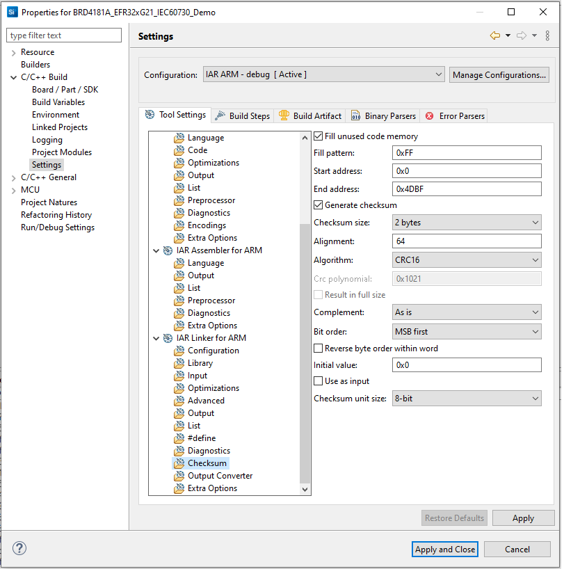
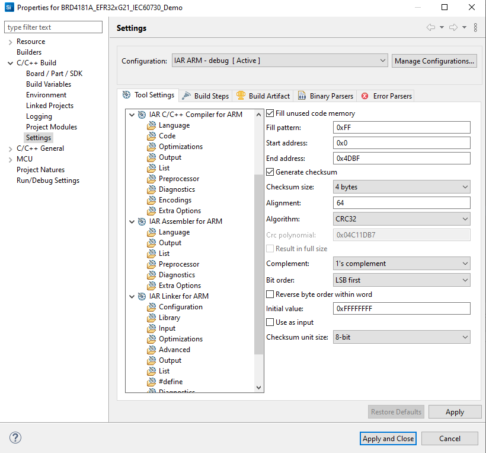

# How to import project

## import BRD4181A_EFR32xG21_IEC60730_Demo.slsproj to Simplicity Studio.

## Run shell script

```
./prebuild.sh efr32mg12p <path to project> IAR
./prebuild.sh efr32mg21  <path to project> IAR
./prebuild.sh efr32mg12p <path to project> GCC
./prebuild.sh efr32mg21  <path to project> GCC
```
## Fix issue if error
if you get error like below

```
/bin/sh^M: bad interpreter: No such file or directory
```

Please run this command to fix it

```
sed -i -e 's/\r$//' <scripts_file>
```

## Configure for IAR compiler

### Use srecord to generate CRC

The "Project > Options > Linker > Extra Options > Use command line options"
adds --place_holder to create/reserve space for the ielftool_checksum symbol and --keep to make sure that the symbol is included

With CRC16
```
--place_holder __checksum,2,.checksum,64
--keep __checksum
```

With CRC32
```
--place_holder __checksum,4,.checksum,64
--keep __checksum
```

The "Project > Options > Linker > List" select "Generate linker map file"

The "Project > Options > Build Actions > Post-build command line" adds the command

```
sh '${ProjDirPath}/scripts/gcc_crc16.sh' '${BuildArtifactFileBaseName}' '' 'C:\srecord-1.64-win32' 'IAR'

sh '${ProjDirPath}/scripts/gcc_crc32.sh' '${BuildArtifactFileBaseName}' '' 'C:\srecord-1.64-win32' 'IAR'
```

### Use IAR to generate CRC

In case you want to use checksum provided by IAR you SHOULD use configuration below

For CRC16



For CRC32



## Note
The function iec60730_stub_functions will be removed when components are completed.