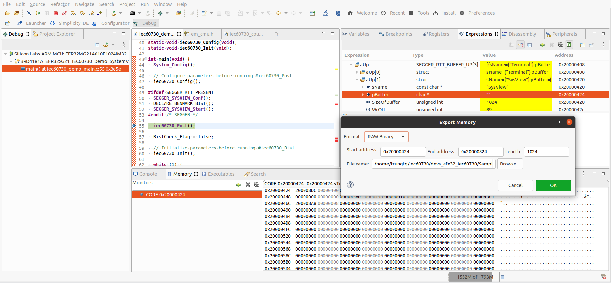

The first, you SHOULD get address of _SEGGER_RTT and export file *.SVDat

then Run SystemView, and get result

Note:
- Get information of variable _SEGGER_RTT (using debug)
  + Get address of pBuffer in aUp[1]
  + Get length
- Memory > Export:
  + Start Address: Value of (1)
  +
