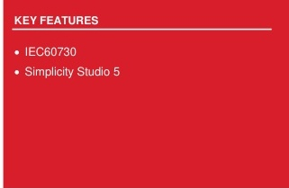
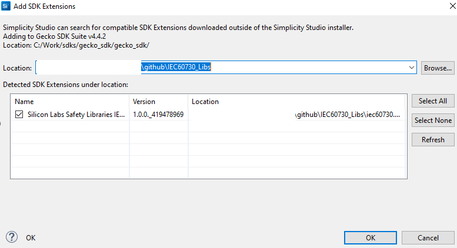

# User Guide: The Library IEC60730 Integration

This document provides instructions for integrating the Library IEC60730 into a project.

This will guide the developer to install the required software. Then guide the configuration of a project and integrate the source code into the project.




SILICON LABS

## Contents

[Contents](#contents)

[Table of pictures](#table-of-pictures)

[1. Background](#1-background)

[2. Install the required software](#2-install-the-required-software)

[3. Add an extension to Simplicity Studio](#3-add-an-extension-to-simplicity-studio)

[4. Generate an example project](#4-generate-an-example-project)

[5. Edit the Linker file](#5-edit-the-linker-file)

[6. Edit the post-build steps](#6-edit-the-post-build-steps)

[7. Edit the included path and preprocessor](#7-edit-the-included-path-and-preprocessor)

[8. Add the source code to the project](#8-add-the-source-code-to-the-project)

[9. Integrate code into the project](#9-integrate-code-into-the-project)

[10. Revision history](#10-revision-history)

## Table of pictures

[Figure 1 Adding Extension to SDK](#figure-1-adding-extension-to-sdk)

[Figure 2 Browse to extension location](#figure-2-browse-to-extension-location)

[Figure 3 Create new project](#figure-3-create-new-project)

[Figure 4 Target, SDK, and Toolchain Selection](#figure-4-target-sdk-and-toolchain-selection)

[Figure 5 Add toolchains](#figure-5-add-toolchains)

[Figure 6 IAR toolchain](#figure-6-iar-toolchain)

[Figure 7 Example Project Selection](#figure-7-example-project-selection)

[Figure 8 Project Configuration](#figure-8-project-configuration)

[Figure 9 Project generation in workspace](#figure-9-project-generation-in-workspace)

[Figure 10 Build Project](#figure-10-build-project)

[Figure 11 Edit the Linker Script Path](#figure-11-edit-the-linker-script-path)

[Figure 12 CRC-16 and CRC-32 script](#figure-12-crc-16-and-crc-32-scripts)

[Figure 13 Add the Command to Post-build steps](#figure-13-add-the-command-to-post-build-steps)

[Figure 14 Result after Post-build complete](#figure-14-result-after-post-build-complete)

[Figure 15 Add the included path and preprocessor](#figure-15-add-the-included-path-and-preprocessor)

[Figure 16 Components support library IEC60730](#figure-16-components-support-library-iec60730)

[Figure 17 Add source code library IEC60730](#figure-17-add-source-code-library-iec60730)

[Figure 18 Assembly code algorithm MARCHC for GCC compiler](#figure-18-assembly-code-algorithm-marchc-for-gcc-compiler)

[Figure 19 Flow chart of the library IEC60730](#figure-19-flow-chart-of-the-library-iec60730)

[Figure 20 Demo OEM files integrated with Library IEC60730](#figure-20-demo-oem-files-integrated-with-library-iec60730)

[Figure 21 IAR define check_sum variable](#figure-21-iar-define-checksum-variable)

[Figure 22 Configuration for watchdog module](#figure-22-configuration-for-watchdog-module)

[Figure 23 Configuration for system clock module](#figure-23-configuration-for-system-clock-module)

## 1. Background

The IEC60730 is a safety standard used in household applications. It defines the test and diagnostic method that ensures the safe operation of devices. We provide the test of the following components: CPU registers, variable memory check, invariable memory check, program counter check, clock check, and interrupt check.

At the time of this writing, the library IEC60730 has been tested on two devices EFR32xG12, and EFR32xG24 on Simplicity Studio 5 (SS5)with toolchain GNU ARM v12.2.1 and SDK version 4.4.2.

## 2. Install the required software.

We use the third-party software [SRecord](http://srecord.sourceforge.net/) to calculate CRC value. Firstly, you need to install this software. If you're using Windows OS, you can go to the link of this software (link above), download the installation, and run the installer to install. If you're using Ubuntu OS, please follow the installation instructions below.

```sh
$ sudo apt update
$ sudo apt install srecord
```

## 3. Add an extension to Simplicity Studio

The safety library IEC60730 is supported by adding the IEC60730 extension, which is built using the software environment.:

- OS-Ubuntu 20.04

- Simplicity Studio 5

This project is organized as an extension of Simplicity Studio. This project is built upon GSDK version 4.4.2, GNU toolchain V12.2.1. The user can download the same version of GSDK from GitHub [GSDK](https://github.com/SiliconLabs/gecko_sdk) and Simplicity Studio V5 download link [Simplicity Studio V5](https://www.silabs.com/developers/simplicity-studio).

To create and build demo projects, the user must add the IEC60730 extension to Simplicity Studio. The procedure would be `Window > Preferences > Simplicity Studio >  SDKs > Gecko SDK Suite v4.4.2 > Add Extension`.


###### Figure 1 Adding Extension to SDK


Press `Browse` to find the directory of this extension. Then choose the folder that has the file name `iec60730.slce`. Simplicity Studio will detect SDK extensions automatically. Click `OK` then `Apply and Close`


###### Figure 2 Browse to extension location

## 4. Generate an example project.

Before using Simplicity Studio to generate the project, you need to add the IEC60730 extension. Please remember the following text:
> `"This extension supports a demo example for EFR32MG families"`

Start a Project. Select `Files > New > Project` to open the New Project Wizards dialog. Choose `Silicon Labs Project Wizard > Finish`.


######  Figure 3 Create new project

To create a new Simplicity Studio® 5 (SSv5) project, follow these three dialog steps:

- Target, SDK, and Toolchain

- Examples

- Configuration

An indicator at the top of the dialog will show you your current position in the process. You can click `Back` at any time to return to a previous dialog if you need to make changes.

For the radio board, in the `Target, SDK, and Toolchain Selection` dialog, if you have connected to or selected a target, all relevant information will be pre-populated. If no target is selected, you can choose the target parts here. For example, you can select `EFR32MG12 2.4GHz 10 dBm Radio Board (Rev A02)` in the Target Boards section, with the Target Device set to `EFR32MG12P332F1024GL125` as shown in the image below.


###### Figure 4 Target, SDK, and Toolchain Selection

Next, choose the SDK you installed, such as `Gecko SDK v4.4.2`. For the `IDE/Toolchain` select the toolchain version, such as `GNU ARM v12.2.1.` Finally, click `NEXT`.

If you have installed the IAR toolchain and want to use it to build the demo project. For adding the IAR toolchain in Simplicity Studio: `Preferences > Toolchains > Add > Browse go to the folder containing the toolchain then click OK > Apply and Close`


###### Figure 5 Add toolchains

After you add your IAR toolchains, in the selection `IDE/Toolchain` choose toolchain `IAR ARM vn.n.n.n`. For example,Simplicity `IDE/IAR ARM v9.20.4.327`.


###### Figure 6 IAR toolchain

In `Example Project Selection`, use the checkboxes or keywords to find the example of interest. To create a radio board example IEC60730 Demo, search the keyword `iec60730` in the search box, related examples will show. Choose `IEC60730 Example Demo`. Click `NEXT`


###### Figure 7 Example Project Selection

In `Project Configuration Selection`, rename and location your project if you want. For the three selections under `With project files`, you can choose any of the selections you want.


###### Figure 8 Project Configuration

Once you finish project creation, the Simplicity IDE perspective opens. There may be a slight delay in the initial configuration.

The project typically opens `README tab`, which contains an example project description, and `OVERVIEW tab`.


###### Figure 9 Project generation in workspace

For the building project, choose the project you want to build and click on the icon hammer to build, or click the right mouse and choose `Build Project`.


###### Figure 10 Build Project

## 5. Edit the Linker file.

We will base on the example extension project above and edit this project to a new linker file that meets the requirements of the library IEC60730.

Some points for editing the linker file are described in IEC 60730's document. You can refer to the modified linker file in our demo example by checking sections 3 and 4 to create our demo. In our demo, the path to the linker file is automated and set to our linker. You should copy the linker file to another location on your PC and start editing it.

After editing the linker file, you need to edit the path pointing to this new linker file. Figure 11 Edit the Linker Script Path shows how to edit the Linker Script Path in Simplicity Studio.

You SHOULD follow these steps: `C/C++Build > Settings > Tool Settings > Memory Layout > Browse`.


###### Figure 11 Edit the Linker Script Path

## 6. Edit the post-build steps.

By default, after building the project, files in `*.bin`, `*.hex`, and `*.s37` formats will be created. If you want to create another format, you SHOULD follow these steps: `C/C++Build  >  Settings  >  Build Steps  > Post-build steps > Command`.

In this context, we need to modify the command in the `Post-build` steps to generate new firmware files with a CRC value appended at the end of the FLASH area. Currently, we support two scripts that calculate CRC16 and CRC32, which can be executed on PCs running Windows or Ubuntu OS. You can find these scripts in the `lib/crc` folder.


###### Figure 12 CRC-16 and CRC-32 scripts

The scripts have suffixes of `_crc16` and `_crc32` respectively. We will use the suffix `_crcNN` for both cases.

Detailed parameters of the `sl_iec60730_cal_crcNN` script can refer to can refer to the document [Support calculate CRC](./support_calculate_crc.md). In our example, two script files supporting CRC-16 and CRC-32 are automatically copied into the project. For a demo example, you can use this command below to calculate the CRC value for file build `*.bin`, `*.hex`, and `*.s37` and file `*.lst` with GCC toolchain :

```sh
$ arm-none-eabi-objdump -t -h -d -S '${BuildArtifactFileBaseName}.axf' >'${BuildArtifactFileBaseName}.lst' && bash ${ProjDirPath}/iec60730_1.1.0/lib/crc/sl_iec60730_cal_crc16.sh ${BuildArtifactFileBaseName} "" "C:\srecord\bin" GCC "0x8000000"
```


###### Figure 13 Add the Command to Post-build steps

Or with IAR toolchains:

```sh
ielfdumparm --all --source ${BuildArtifactFileBaseName}.out > ${BuildArtifactFileBaseName}.lst && bash ${ProjDirPath}/iec60730_1.1.0/lib/crc/sl_iec60730_cal_crc16.sh ${BuildArtifactFileBaseName} "" "C:\srecord\bin" IAR "0x8000000"
```

> [!NOTE]
> In the default configuration, `SL_IEC60730_CRC_DEBUG_ENABLE` support debugging the CRC test module invariable memory
> calculations on demo project is enabled. If you want to disable this configuration, you should copy either `sl_iec60730_cal_crc32.sh` or
> `sl_iec60730_cal_crc16.sh` in the path: `lib/crc/` which helps a CRC-calculated image file for testing.
> You must flash the image with the corresponding image file suffixes _crc16 and _crc32.
>
> If, during the project configuration step, you choose an option in the `With Project File` section either `Link to SDK and Copy Project Structures` or `Link to Source`,
> you will need to copy `sl_iec60730_cal_crc32.sh` or `sl_iec60730_cal_crc16.sh` to `lib/crc` folder of your current project directory.
>
> After the build of a project is complete, it will call the command in the Post-build steps to create <project_name>_crc16 or <project_name >_crc32 files with the extension `*.bin`, `*.hex`, and `*.s37`.


###### Figure 14 Result after Post-build complete

## 7. Edit the included path and preprocessor.

Edit the Include paths (-l) to the location of the source code of the Library IEC60730.

You `SHOULD` follow these steps: `C/C++Build > Settings > Tool Settings > GNU ARM C Compiler` choose `Include` or `Preprocessor` for include header files and add definitions to your project.


###### Figure 15 Add the included path and preprocessor

Edit preprocessor, the user needs definitions as below.

- SL_IEC60730_BOARD_HEADER="sl_iec60730_board.h"

By default, the demo example has the definitions above. You can refer to our demo example of these settings.

## 8. Add the source code to the project.

In our example, after adding the SDK extension, the software component will have a few components that support adding code files (*.c, *. s) of Library IEC60730 to the project:


###### Figure 16 Components support library IEC60730

When you install these components, the source code library IEC60730 will be added. For example:


######  Figure 17 Add source code library IEC60730

Component `IEC60730 VMC MarchC`(see [Figure 16](#figure-16-components-support-library-iec60730)) support for adding assembly code algorithm `MarchC` and `MarchXC`. If you use the IAR compiler, this component will add to assembly files `sl_iec60730_vmc_marchc_iar.S` and `sl_iec60730_vmc_marchxc_iar.S`. If you use the GCC compiler, this component will add `sl_iec60730_vmc_marchc.S` and `sl_iec60730_vmc_marchxc.S` for the test VMC module.


###### Figure 18 Assembly code algorithm MARCHC for GCC compiler

## 9. Integrate code into the project.

The library IEC60730 has been divided into 2 main test phases: Power on Self-Test (POST) and Build In Self-Test (BIST). [Figure 19 Flow chart of the library IEC60730](#figure-19-flow-chart-of-the-library-iec60730) shows the basics of the library IEC60730 integration into a user software solution.


###### Figure 19 Flow chart of the library IEC60730

In our example, we have added a demo `oem` foler  (Original equipment manufacturer) to integrate with the library IEC60730 to test steps such as flow charts fully.


###### Figure 20 Demo OEM files integrated with Library IEC60730

If you want to add your OEM code and don't want to use our OEM files demo, you COULD add your OEM code via the following steps below:

### 1. Requires declaration and initialize variables for IEC60730 library with constant values. Refer function `oem_iec60730_init` in file `oem_iec60730.c`.

```sh
sl_iec60730_vmc_test_multiple_regions_t oem_vmc_test;
sl_iec60730_imc_test_multiple_regions_t oem_imc_test __CLASSB_RAM;
sl_iec60730_irq_cfg_t oem_irq_config;
```


These three variables are used for interrupt, invariable memory check and variable memory check.

### 2. To perform an invariable memory check, the library uses CRC (Cyclic Redundancy Check) calculations for Flash memory. If the user calculates using hardware, the user will need to initialize the GPCRC module to support the calculation. Users can also enable `#define SL_IEC60730_CRC_USE_SW_ENABLE` for software calculation. To calculate the CRC value, It will have two options:

   - Start from the user's specified address and continue to the end of the Flash region.

   - Calculate multiple regions by providing the starting and ending addresses for each one. For additional details, refer to the file `oem_iec60730.c`.

And then store the calculated CRC value in the designated end-flash variable. Currently, the `check_sum` variable is set to the end address of the user code that utilizes the IEC Library.

In the case of the GCC toolchain, the `check_sum` variable is defined in the linker file. For the IAR toolchain, you can find it in the demo example. Right-click on the project and navigate to Properties > C/C++ Build > Settings > IAR Linker for ARM. In the Extra Options section, you can add the option for CRC_16.

```C
--keep check_sum --place_holder check_sum,2,.checksum,64
```

Or for CRC_32:

```C
--keep check_sum --place_holder check_sum,4,.checksum,64
```

By default, the demo project uses option CRC_16


###### Figure 21 IAR define checksum variable

### 3. Configure Watchdog Test: this configuration determines which watchdog unit will be checked.The library does not initialize the watchdog units, the user should do the initialization. We support configuration for watchdog module


###### Figure 22 Configuration for watchdog module

The two define used to enable watchdog testing are used in the application:

```C
#define SL_IEC60730_WDOG0_ENABLE
#define SL_IEC60730_WDOG1_ENABL
```

If these macros are not enabled, it will show an error saying watchdog checking is not enabled.

- To clear reset cause flags in the RSTCASUES register after watchdog testing is completed. Enable configuration of the definition of macro `#define SL_IEC60730_RSTCAUSES_CLEAR_ENABLE`. In our demo, this feature is enabled.

- The static variable `iec60730_watchdog_count` must be located at a memory location that is not cleared when system startup `(section".ram_no_clear")`.

- The global variable `iec60730_watchdog_state` must be located at a memory location that is not cleared when system startup `(section ".ram_no_clear")`. To enable saving `iec60730_watchdog_state` to backup RAM on Series 2, enable the macro `#define SL_IEC60730_SAVE_STAGE_ENABLE`. By default, it will be disabled.Define macro `SL_IEC60730_BURAM_IDX` to select which register of the BURAM will be used. The default value is `0x0UL`.

### 4. Before calling the `sl_iec60730_post` function,we need to do the following steps:

- Configure the clock for the timers. You can refer to these configurations in our demo examples, file `oem_iec60730_init_device.c`.

- Create two timers with 10 milliseconds (ms) and 100 milliseconds (ms) interrupt periods (parameters 10ms and 100ms are recommended values) to test the clock and the clock switch. You can refer our demo example, file `oem_iec60730_timer.c` for more details. Note that adjusting the 10ms and 100ms values will require adjusting other configuration `IEC60730_SYS_CLK`:


###### Figure 23 Configuration for system clock module

### 5. To perform a variable memory check, the library uses MarchC and MarchXC algorithms. It will have two options:

   - Start from the user's specified address in RAM and continue to the end of the RAM region.

   - Calculate multiple RAM regions by providing the starting and ending addresses for each one. For additional details, refer to the file `oem_iec60730.c`.

### 6. Before calling the `sl_iec60730_bist` function, we `SHOULD` set the flag for the `sl_iec60730_program_counter_check` variable. Some of the following flags are set by the Library IEC60730: `IEC60730_VMC_COMPLETE,IEC60730_IMC_COMPLETE,IEC60730_CPU_CLOCKS_COM PLETE,and IEC60730_INTERRUPT_COMPLETE`.

Other flags (IEC60730_GPIO_COMPLETE, IEC60730_ANALOG_COMPLETE,etc.) are up to you to develop additional test functions. The `sl_iec60730_program_counter_check` variable `SHOULD` set the flags corresponding to the unavailable test to ensure that the Program Counter Check is guaranteed.

In the demo examples,you will often see the following code.

```C
sl_iec60730_program_counter_check   |=IEC60730_GPIO_COMPLETE
                                    | IEC60730_ANALOG_COMPLETE
                                    | IEC60730_OEM0_COMPLETE
                                    | IEC60730_OEM1_COMPLETE
                                    | IEC60730_OEM2_COMPLETE
                                    | IEC60730_OEM3_COMPLETE
                                    | IEC60730_OEM4_COMPLETE
                                    | IEC60730_OEM5_COMPLETE
                                    | IEC60730_OEM6_COMPLETE
                                    | IEC60730_OEM7_COMPLETE;
```

- On demo eample, executes the external communication test that sets the `IEC60730_COMMS_COMPLETE` flag by itself.

- The function `sl_iec60730_bist` SHOULD be called in periodical task or a supper loop while(1).

### 7.  Remember to increment the IRQ counter variable every time the interrupt to test occurs. You can refer to the `oem_irq_exec_count_tick` function in our demo examples.


```C
void TIMERO_IRQHandler(void) {

...

oem_irq_exec_count_tick();

}

void oem_irq_exec_count_tick(void){

oem_irq_exec_count[0]++;

}

```

### 8. Create the function `sl_iec60730_safe_state`. The purpose of this function is to handle when an error occurs. An example of handling of this function refer files `oem_iec60730_functions.c`. After generating our demo example successfully, you also `COULD` add your code in file app.c and app.h

## 10. Revision history

| Revision | Date | Description |
| -- | -- | -- |
| 0.1.0 | Oct 2021 | Initial Revision |
| 0.2.0 | Nov 2021 | Section 7: Added description for Watchdog |
| 0.3.0 | Mar 2023 | Remove Section 8. |
| 0.4.0 | Apr 2023 | Update document |
| 1.0.0 | Sep 2023 | Section 1: Added mention aboutEFM32PG22 and EFR32xG22devices. |
| 1.1.0 | June 2024 | Adding Section 3 and Section 4 for support creates a Library ExtensionUpdated other sections for suit withthe released package EFR32xG12and EFR32xG24 devices. |
| 2.0.0 | Nov 2024 | Rewrite the documentation by the re-factory code of the library support device EFR32MG families. |


